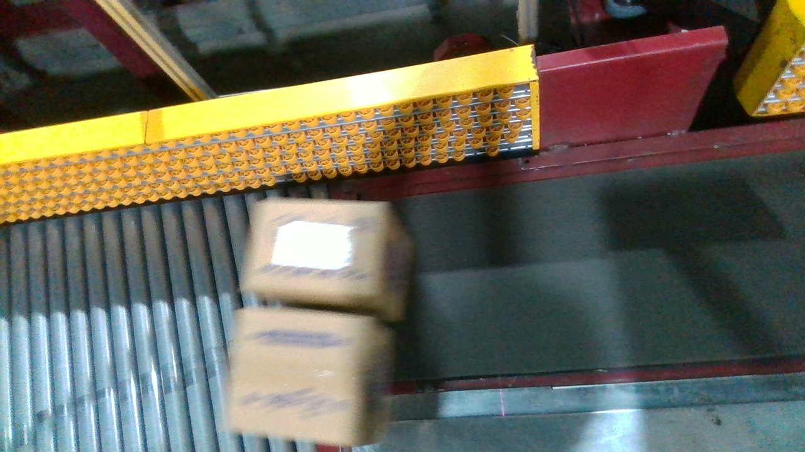

# POSP
This is a project for picking out s single package when there are parallel packages. The Normal situation is that two packages are closing to each other, but sometimes a difficult situations is that one package will be too close to the other one or two packages.

**POSP** means Pick Out Single Package, this project aims at solving the problem of parallel packages transporting on a conveyor belt. Like the video shows below:

Some screenshots about the detection of parallel packages are like bellow:  
<table  align="center">
    <tr>
    <td >

        
    </td >

    </tr>
    <tr>
    <td >

    
    </td >

    </tr>
    <td >

    
    </td >

    </tr>
</table>
